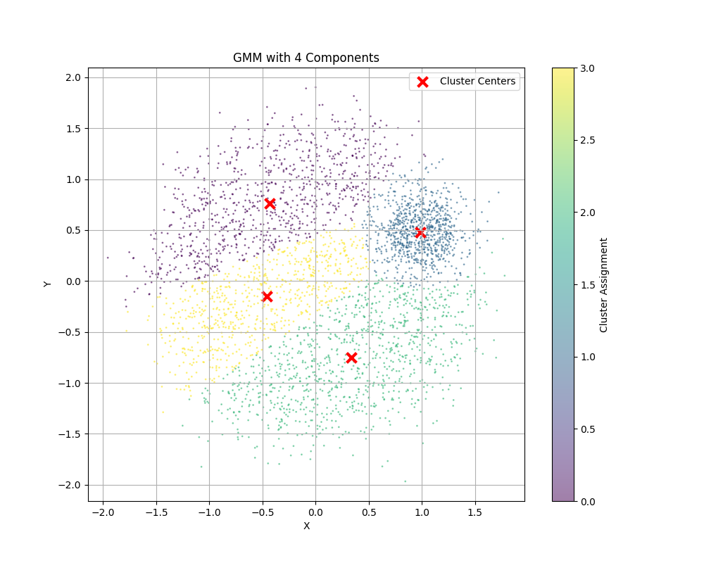

# KDE

## Task 3: KDE vs GMM (30 Marks)

KDE fit:


GMM with 2 components


GMM with 3 components


GMM with 4 components


### Observations:

`GMM with 2 Components`:
1. The model identifies two main clusters, with cluster centers marked by red X's
1. One cluster captures the large diffused circular pattern (purple)
3. The other cluster captures the smaller dense region on the right (yellow)
4. This is a rather coarse approximation of the underlying data structure, as it forces the model to fit just two Gaussian distributions to what appears to be a more complex pattern


`Changes as GMM Components Increase`:
1. From 2 to 3 Components (Image 2):
- The model now separates the data into three clusters
- The dense region on the right remains as one cluster
- The larger diffused circle is now split into two clusters
- This provides a better fit as it can capture more nuanced structure in the data
2. From 3 to 4 Components (Image 1):
- The model further refines its clustering
- The dense region on the right still maintains its distinct cluster
- The larger diffused circle is now split into three clusters
- The additional component allows the model to capture more subtle variations in the data distribution
- This appears to provide the most detailed representation of the underlying structure

`KDE Model`:
1. The KDE model provides a smooth, continuous density estimation
2. It clearly shows the density variation across the entire space
3. It captures both the high-density region (yellow/green) on the right and the more diffused regions (blue)
4. The density gradients are smooth and natural, without hard boundaries between regions
5. It successfully represents the true underlying continuous nature of the data distribution

`In summary`

1. The GMM becomes more flexible and provides a better fit as the number of components increases
2. The KDE model provides a consistent and natural representation of the data density without imposing discrete boundaries
3. Both approaches have their merits: GMM is better for explicit clustering and identifying distinct components, while KDE is better for smooth density estimation and capturing continuous variations in the data distribution.

---

## Patterns in MFCC Spectrograms

1. **Feature Band Consistency**: 
- The general distribution of energy across the frequency bands (vertical axis) is somewhat similar among all the spectrograms. 
- This indicates that certain frequency ranges are characteristic when pronouncing digits regardless of the speaker.

2. **Temporal Variability**: 
- Each spectrogram varies slightly in the number of time frames (horizontal axis), likely due to individual differences in the pronunciation duration of digits.
- However, the essential structure remains similar, with most of the energy concentrated in the initial frames, tapering off towards the end.

3. **Amplitude Patterns**: 
- The color intensity levels are relatively consistent across the speakers, suggesting that the amplitude range remains in a similar dB range when different speakers pronounce a digit. 
- Peaks (yellow regions) and valleys (darker areas) appear in roughly similar patterns, though there are minor variations in intensity.

4. **Distinctive Feature Regions**: 
- Each spectrogram shows bands of intensity that seem to be more prominent in some speakers than others, possibly due to variations in voice pitch and timbre. 
- However, these bands tend to align across the spectrograms, indicating core phonetic components of the digits.


## Why HMM for Digit Recognition?

Hidden Markov Models (HMMs) are highly useful for digit recognition tasks using MFCC features because of their ability to model **sequential and time-varying data** like speech.

### 1. **Temporal Structure in Speech**
   - Speech is inherently sequential: each spoken digit unfolds over time, with different sounds occurring in a specific order.
   - HMMs are well-suited to model this structure because they have **hidden states** that can represent the different phonemes or sound patterns in each digit. Each state can be thought of as capturing a segment of the sound, such as a specific phoneme or sub-phoneme.

### 2. **Ability to Handle Variability in Duration**
   - Different people may say the same digit in varying amounts of time (e.g., some might say "nine" faster or slower than others).
   - HMMs allow for **variable lengths of observations** due to their probabilistic nature, meaning they can model sequences of different lengths and capture the variation in duration naturally.

### 3. **MFCC Features as Observations for HMMs**
   - MFCC features are compact representations of speech that capture the spectral characteristics and key phonetic information.
   - HMMs can use these features as **observations**, with each hidden state emitting a probability distribution over MFCCs. The HMM learns which MFCC patterns are likely for each state, which helps in distinguishing between different digits based on their characteristic sound patterns.

### 4. **Recognition via Probabilistic Matching**
   - During recognition, HMMs compute the **likelihood of an observation sequence** (MFCCs) given each trained model for the digits. By comparing these likelihoods, the HMM can determine the most probable digit being spoken.
   - This probabilistic approach makes HMMs robust to small variations in pronunciation, accent, and noise, which are common in real-world digit recognition.

## Generalization on Self-Recordings:
```
Test accuracy: 91.33%
Predicted Label: 6      Actual Label: 0
Predicted Label: 6      Actual Label: 1
Predicted Label: 6      Actual Label: 2
Predicted Label: 6      Actual Label: 3
Predicted Label: 6      Actual Label: 4
Predicted Label: 6      Actual Label: 5
Predicted Label: 6      Actual Label: 6
Predicted Label: 6      Actual Label: 7
Predicted Label: 6      Actual Label: 8
Predicted Label: 6      Actual Label: 9
Test Accuracy on Self Recordings: 10.00%
```
### Observations:
The results obtained indicate that while the HMM performs well on the test set (with a test accuracy of 91.33%), it struggles significantly on my own recordings, with only a 10.00% accuracy. Potential explains include:

### 1. **Data Mismatch Between Training and Personal Recordings**
   - The HMM model was likely trained on a dataset with specific audio characteristics (e.g., recording conditions, microphone quality, background noise, accent, and speech tempo).
   - My personal recordings may differ in terms of **acoustic properties**, such as recording environment, microphone quality, and background noise. HMMs can be sensitive to such differences, leading to poor generalization on data outside the training distribution.

### 2. **Speaker Dependency**
   - Speech models, especially those trained on a limited set of speakers, may become **speaker-dependent** and perform poorly on unseen speakers.
   - If the training data does not include diverse voices, accents, or speech patterns, the model may not generalize well to new speakers, resulting in poor performance on your recordings.

---
# Counting Bits

## Hyperparameter Tuning
hidden_size: 32
n_layers: 1
dropout: 0.1
```
Using device: cpu
Random Baseline MAE: [0.4896, 0.8256, 1.08, 1.4272, 1.6688, 1.84, 2.3104, 2.5904, 2.6112, 2.8976, 3.0944, 3.4656, 3.7936, 3.8304, 4.2416, 4.5792]
Epoch [1/10], Train Loss: 0.6995, Val Loss: 0.1857, Val MAE: 0.1857
Epoch [2/10], Train Loss: 0.4365, Val Loss: 0.4568, Val MAE: 0.4568
Epoch [3/10], Train Loss: 0.4573, Val Loss: 0.4167, Val MAE: 0.4167
Epoch [4/10], Train Loss: 0.4488, Val Loss: 0.2920, Val MAE: 0.2920
Epoch [5/10], Train Loss: 0.4378, Val Loss: 0.1451, Val MAE: 0.1451
Epoch [6/10], Train Loss: 0.4291, Val Loss: 0.1733, Val MAE: 0.1733
Epoch [7/10], Train Loss: 0.4385, Val Loss: 0.6029, Val MAE: 0.6029
Epoch [8/10], Train Loss: 0.4394, Val Loss: 0.3654, Val MAE: 0.3654
Epoch [9/10], Train Loss: 0.4335, Val Loss: 1.0190, Val MAE: 1.0190
Epoch [10/10], Train Loss: 0.4385, Val Loss: 0.2265, Val MAE: 0.2265
mae_value:
[0.06334092887118459, 0.05977056687697768, 0.10193996271118522, 0.121524796821177, 0.13540081353858113, 0.15070872195065022, 0.1610692087560892, 0.18003234639763832, 0.195501740090549, 0.23178236093372107, 0.2723127715289593, 0.3296012096107006, 0.37388393469154835, 0.40757331624627113, 0.4434883836656809, 0.44282382540404797, 0.45007670670747757, 0.4711808320134878, 0.49721956066787243, 0.5348121803253889, 0.6392872333526611, 0.786918431520462, 0.9757833927869797, 1.2765717953443527, 1.4893396943807602, 1.7932134717702866, 2.279262460768223, 2.5892519056797028, 3.180743992328644, 3.4616005271673203, 3.8709582537412643, 4.382121846079826]
baseline_mae:
[0.522, 0.788, 1.081, 1.449, 1.709, 1.895, 2.176, 2.453, 2.61, 2.921, 3.214, 3.435, 3.695, 3.929, 4.116, 4.438, 4.724, 5.008, 5.233, 5.188, 5.687, 5.948, 6.177, 6.6, 7.001, 7.03, 7.268, 7.363, 7.659, 8.062, 8.407, 8.565]

```
hidden_size: 32
n_layers: 2
dropout: 0.2
```
Using device: cpu
Random Baseline MAE: [0.512, 0.808, 1.1664, 1.368, 1.6688, 1.9088, 2.1664, 2.4656, 2.5536, 2.9632, 3.1856, 3.4736, 3.8112, 4.08, 4.1824, 4.4928]
Epoch [1/10], Train Loss: 0.7741, Val Loss: 0.5235, Val MAE: 0.5235
Epoch [2/10], Train Loss: 0.4460, Val Loss: 0.3689, Val MAE: 0.3689
Epoch [3/10], Train Loss: 0.4499, Val Loss: 0.1862, Val MAE: 0.1862
Epoch [4/10], Train Loss: 0.4427, Val Loss: 0.3258, Val MAE: 0.3258
Epoch [5/10], Train Loss: 0.4383, Val Loss: 0.1743, Val MAE: 0.1743
Epoch [6/10], Train Loss: 0.4303, Val Loss: 0.1762, Val MAE: 0.1762
Epoch [7/10], Train Loss: 0.4341, Val Loss: 0.0968, Val MAE: 0.0968
Epoch [8/10], Train Loss: 0.4289, Val Loss: 0.1540, Val MAE: 0.1540
Epoch [9/10], Train Loss: 0.4306, Val Loss: 0.2086, Val MAE: 0.2086
Epoch [10/10], Train Loss: 0.4309, Val Loss: 0.1508, Val MAE: 0.1508
mae_value:
[0.06283735018223524, 0.06811646092683077, 0.08210235694423318, 0.12450776295736432, 0.15159169025719166, 0.15135893505066633, 0.15958637464791536, 0.15881276223808527, 0.1651858687400818, 0.16561054065823555, 0.17580644972622395, 0.1831266274675727, 0.2010759934782982, 0.2080505257472396, 0.20487159583717585, 0.19267267268151045, 0.20159179251641035, 0.2982601020485163, 0.4074338898062706, 0.5965253617614508, 0.957733079791069, 1.2142090946435928, 1.6113876104354858, 1.8821993693709373, 2.3880635648965836, 2.8093595057725906, 3.28796948492527, 3.6580706536769867, 4.128940045833588, 4.627819538116455, 5.175176829099655, 5.413724333047867]
baseline_mae:
[0.491, 0.819, 1.137, 1.408, 1.643, 1.956, 2.173, 2.415, 2.722, 2.874, 3.221, 3.55, 3.837, 3.931, 4.077, 4.449, 4.713, 4.844, 5.086, 5.612, 5.617, 6.06, 6.203, 6.525, 6.79, 7.07, 7.013, 7.406, 7.826, 7.829, 8.4, 8.529]
```


## Analysis of Model Performance wrt Sequence Length


### Explanation:
1. `Model Performance Analysis`:
- For shorter sequences (length 1-15), the model performs exceptionally well with MAE close to 0
- From lengths 16-20, there's a slight increase in error but still maintains good performance
- After length 20, there's a more noticeable increase in error
- The error grows more rapidly for lengths > 25

2. `Comparison with Random Baseline`:
- The model significantly outperforms the random baseline across all sequence lengths
- While the random baseline error grows linearly with sequence length, the model's error grows more slowly
- Even at length 32, the model's MAE (~4) is about half of the random baseline's MAE (~8.5)

3. `Possible Reasons for Performance Pattern`:

a) Early Stability (1-15):
- This matches the training data range (1-16)
- Model has seen plenty of examples at these lengths during training
- The task is simpler for shorter sequences

b) Gradual Degradation (16-32):
- Model has to generalize to unseen sequence lengths
- Longer sequences mean more opportunities for error accumulation in the RNN
- Memory limitations of the RNN architecture might start affecting performance

4. `Conclusions`:

`Strengths`:
- Excellent performance within training range
- Successful generalization to longer sequences
- Maintains significant advantage over random guessing even for unseen lengths

`Limitations`:
- Performance degrades for sequences longer than training length
- Error increases more rapidly after length 25


---
# OCR

Hyperparameters 1:
```
IMAGE_HEIGHT = 64
IMAGE_WIDTH = 256
BATCH_SIZE = 32
MAX_WORD_LENGTH = 20
HIDDEN_SIZE = 256
NUM_LAYERS = 2
LEARNING_RATE = 0.001
```

```
OCR Model Training Report
==================================================

Training completed after 10 epochs
--------------------------------------------------

Final Metrics:
Training Character Accuracy: 0.9489
Validation Character Accuracy: 0.7104
Training Word Accuracy: 0.7840
Validation Word Accuracy: 0.0309

Example Predictions:
--------------------------------------------------
Ground Truth | Prediction
--------------------------------------------------
dyspnoic     | dyspnoio
bejezebel    | bejeaeeel
damine       | damine
dreamworld   | dreamwordd
carnaria     | carnaria
fondlingly   | fondlingly
frontager    | frontager
brucite      | brucite
collegiation | collegiation
engross      | engross

Training History:
--------------------------------------------------
Epoch 1:
Character Accuracy: 0.4824
Word Accuracy: 0.0029
-------------------------
Epoch 2:
Character Accuracy: 0.6159
Word Accuracy: 0.0178
-------------------------
Epoch 3:
Character Accuracy: 0.6721
Word Accuracy: 0.0234
-------------------------
Epoch 4:
Character Accuracy: 0.6622
Word Accuracy: 0.0264
-------------------------
Epoch 5:
Character Accuracy: 0.6650
Word Accuracy: 0.0270
-------------------------
Epoch 6:
Character Accuracy: 0.6915
Word Accuracy: 0.0292
-------------------------
Epoch 7:
Character Accuracy: 0.7194
Word Accuracy: 0.0283
-------------------------
Epoch 8:
Character Accuracy: 0.6786
Word Accuracy: 0.0292
-------------------------
Epoch 9:
Character Accuracy: 0.7035
Word Accuracy: 0.0307
-------------------------
Epoch 10:
Character Accuracy: 0.7104
Word Accuracy: 0.0309
-------------------------
```

Hyperparameters-2:
```
IMAGE_HEIGHT = 64
IMAGE_WIDTH = 256
BATCH_SIZE = 64
MAX_WORD_LENGTH = 20
HIDDEN_SIZE = 256
NUM_LAYERS = 4
LEARNING_RATE = 0.001
```

```
OCR Model Training Report
==================================================

Training completed after 10 epochs
--------------------------------------------------

Final Metrics:
Training Character Accuracy: 0.9342
Validation Character Accuracy: 0.7375
Training Word Accuracy: 0.7064
Validation Word Accuracy: 0.0265

Example Predictions:
--------------------------------------------------
Ground Truth | Prediction
--------------------------------------------------
abaff        | abaff
fastland     | fastland
fireworm     | fireworm
greenswarded | greesswarded
eradicant    | eradicant
corge        | corge
complected   | complected
dukedom      | dukedom
amphicarpous | amphicarpous
germination  | germination

Training History:
--------------------------------------------------
Epoch 1:
Character Accuracy: 0.1493
Word Accuracy: 0.0000
-------------------------
Epoch 2:
Character Accuracy: 0.2639
Word Accuracy: 0.0001
-------------------------
Epoch 3:
Character Accuracy: 0.4935
Word Accuracy: 0.0036
-------------------------
Epoch 4:
Character Accuracy: 0.6036
Word Accuracy: 0.0107
-------------------------
Epoch 5:
Character Accuracy: 0.6698
Word Accuracy: 0.0211
-------------------------
Epoch 6:
Character Accuracy: 0.6886
Word Accuracy: 0.0232
-------------------------
Epoch 7:
Character Accuracy: 0.6904
Word Accuracy: 0.0260
-------------------------
Epoch 8:
Character Accuracy: 0.7127
Word Accuracy: 0.0292
-------------------------
Epoch 9:
Character Accuracy: 0.7075
Word Accuracy: 0.0280
-------------------------
Epoch 10:
Character Accuracy: 0.7375
Word Accuracy: 0.0265
-------------------------
```

Training Report: `data/interim/5/OCR/`


### Comparison with Random Baseline:

Character Accuracy of Random baseline: 3.87%

Our trained model Character Accuracy: 71.04%
- The model significantly outperforms the random baseline across all sequence lengths
---

